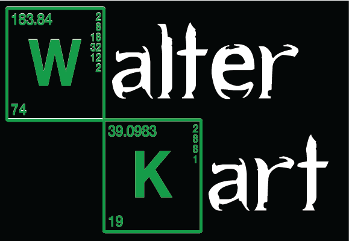

   
   

  <h1>&nbsp;&nbsp;&nbsp;&nbsp;&nbsp;&nbsp;&nbsp;&nbsp;&nbsp;&nbsp;&nbsp;&nbsp;&nbsp;&nbsp;&nbsp;&nbsp;&nbsp;&nbsp;&nbsp;&nbsp;About Me</h1>
  
&nbsp;&nbsp;&nbsp;&nbsp;&nbsp;&nbsp;&nbsp;&nbsp;&nbsp; -  Hi! I am Violet Blake, a first year Data Science student at   &nbsp;&nbsp;&nbsp;&nbsp;&nbsp;&nbsp;&nbsp;&nbsp;&nbsp;Michigan Technological University!   

&nbsp;&nbsp;&nbsp;&nbsp;&nbsp;&nbsp;&nbsp;&nbsp;&nbsp; -  In my free time I enjoy reading, biking, playing the piano,   &nbsp;&nbsp;&nbsp;&nbsp;&nbsp;&nbsp;&nbsp;&nbsp;&nbsp;and travel!   

&nbsp;&nbsp;&nbsp;&nbsp;&nbsp;&nbsp;&nbsp;&nbsp;&nbsp; -  Some of my skills: Java, C++, C#, Microsoft Visual Studio,  &nbsp;&nbsp;&nbsp;&nbsp;&nbsp;&nbsp;&nbsp;&nbsp;&nbsp;Adobe Photoshop/Illustrator   

 
 

<h1>Projects</h1>
 
Check out my Breaking Bad/Stardew Valley inspired platformer - Walter Kart! You can download this from my itch.io using the following link:
 
 

   
&nbsp;&nbsp;&nbsp;&nbsp;<a href="https://anants.itch.io/walter-kart">Walter Kart</a> 

 
 
<h1>Links</h1>
 
<a href="resume.docx.pdf">My Resume</a> &nbsp;&nbsp;&nbsp;&nbsp;&nbsp;&nbsp;&nbsp;&nbsp;&nbsp;&nbsp;&nbsp;&nbsp; <a href="https://github.com/vablake4">My Github</a>
&nbsp;&nbsp;&nbsp;&nbsp;&nbsp;&nbsp;&nbsp;&nbsp;&nbsp;&nbsp;&nbsp;&nbsp;<a href="https://www.linkedin.com/in/violet-blake-b56138386/">My LinkedIn</a>

   
